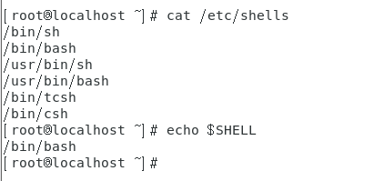

# Linux 第三章


## 1.什么是shell

​		**Linux的字符界面通常被称之为shell。**其实shell本来是指用户的系统界面，它为用户和系统内核之间进行交互操作提供了一种接口。图形界面和字符界面都属于shell，图形界面的shell称为GUI(Graphic User Interface)，字符界面的shell称为CLI(Command Line Interface)，像GNOME就属于GUI，由于Linux的操作以字符为主，**因此通常shell通常专指CLI**。

​		Shell其实也是Linux中的一个程序，它将用户输入的命令解释成，系统内核能理解的语言，命令执行之后再将结果以用户可以理解的方式显示出来。


​		Linux中负责提供shell功能的软件有很多，如SH,Zsh,Csh.....，**在CentOS 7中默认使用的shell是Bash**。

我们可以通过以下命令来查看Linux系统提供的shell有哪些：

```shell
cat /etc/shells	
echo $SHELL				// 查看当前系统所使用的是哪种shell
```



### 1.1.启动shell

​		

​		Linux是一个真正的多用户的操作系统，这表示它可以接收多个用户登录，而且还允许同一用户从不同终端进行多次登录。每个用户登录之后都会自动启用shell,打开命令输入界面。

​		**通常我们将键盘鼠标和显示器这样的输入输出设备称为一个终端。**直接连接在电脑上的称之为**物理终端**。在操作安装有Windows系统的电脑时，通常只有一套物理终端和一个操作界面。Linux支持**虚拟终端**，在操作安装有Linux系统的电脑时，用户虽然面对的也一套物理终端设备，但又可以通过虚拟机打开多个界面同时操作，互不干扰。

​		我们在Linux桌面可以按住**Ctrl+Alt+F2**--F6进入命令界面，**Ctrl+Alt+F1进入图形界面。**我们可以看出Linux提供的虚拟机终端一共又6个，其中第一个为图形界面，2-6个为命令符界面。值得注意的是，**在字符界面下输入密码，将不再进行任何显示，**大大提高了安全性。

​		终端的缩写为tty，在字符界面下输入tty命令就可以显示目前所在的终端号。

```
tty
```


### 1.2.用MobaXterm连接shell

​		现在软件市场有很多终端工具，如：secureCRT,XShell等。当然MobaXterm也是一款比较强大的终端连接工具，它支持SSH,FTP,VNC等功能，而且免费版的功能已经足够我们使用。

**连接步骤：**

1.点击Session创建会话：


2.点击SSH创建连接，在Remote Host中输入IP地址，并创建一个用户名，端口号采用默认端口号22：


3.使用用户名和密码登录使用。


## 2.修改IP

​		由于之前我们使用ifconfig ens33 192.168.80.128/24修改的IP地址是属于临时地址，随时都有可能被系统修改。如果我们要想长期使用这个IP进行连接，那么我们就需要在文件中修改IP来保存。

​		1.在文件中修改IP的命令如下：

```
vim /etc/sysconfig/network-scripts/ifcfg-ens33
```

​		2.进入文件后按i进行设置，将**BOOTPROTO="static"**，再增加

```
IPADDR=192.168.80.128
NETMASK=255.255.255.0
// 如需上网添加网关和DNS
GATEWAY=192.168.12.1
DNS=192.168.19.2
```

​		3.添加后按esc键再执行保存命令：

```
：wq			// 保存
```

## 3.命令提示符

​		启动shell之后，首先可以看到类似于“[root@localhost ~]#”形式的命令提示符。

​		命令提示符是Linux字符界面的标志，其中**"root"表示登录的用户名账户**，**"localhost"表示本机主机名**，**"~"是一个特殊符号，泛指用户家的目录**，root用户家的目录就是/root,**"#"表示当前用户为管理员用户**，如果登录的是**普通用户，最后一个符号就是"$"**。

```shell
pwd          		// 查看当前用户的家目录==print work directory
cd 文件夹名			 // 切换到某文件夹==change directory
su 用户名			 // 切换到用户==switch user
exit			   // 退出
```

​		由于在Linux系统中，用户用当前账户登录后还可以用响应的命令切换其他用户登录，以实现不同的权限功能，所以命令提示符是用户判断当前用户的重要依据。


## 4.shell的命令格式

​		shell命令可由命令名、选项、参数构成，基本格式如下：

```
命令名 [选项] [参数]
```

​		命令名是描述命令功能的英文单词或缩写。如：date表示日期，who表示谁在系统中，cp是copy的缩写，表示拷贝文件等。在shell命令中，命令名必不可少，并且总是位于最前面。	

​		选项的具体作用是调节命令的具体功能，同一命令采用不同的选项，其功能各不相同。选项可以有一个，也可以有多个，也可能没有。选项一般以"**-**"开头，当有多个选项时，可以只使用一个"-"符号。如“ls -l -a”与“ls -al”功能完全相同。还有一些选项以"--"开头，这些选项通常是一个单词或一个词组。如“ls --help”。还有一些选项不需要“-”,比如“ps aux”。

​		参数是命令的处理对象，通常情况下，参数是文件名、目录名或用户名等内容。

​		**注意：命令名、选项和参数之间必须有空格隔开**。

```shell
ls					// 查看指定目录下的内容==list
ls -l				// 查看长文件格式==list long
ls -a				// 	显示所有文件==list all  .开头的为隐藏文件
ls -l /home			// 完整命令格式
```

​		在shell中，一行也可以键入多行命令，中间用";"隔开。另外**如果在一行命令后加“\”，就表示另起一行继续输入**。

​		在使用命令时注意，**Linux是区分大小写的**，即同一个命令大小写的含义不同。**通过上下方位键可以调出之前执行过的命令**。


## 5.关机与重启命令

​		Linux中最简单的关机和重启的命令是**poweroff和reboot**。利用这两个命令关机或重启系统时，会把当前用户的更改写入到磁盘中。但没有给其他用户关机或重启的信号，这可能导致用户数据丢失。因而这两个命令更适合没有其他用户时：

```shell
poweroff 				// 关机
reboot					// 重启
halt					// 挂起
```

​		除了这两个命令外，还有其他的命令用来关机或重启，比如"shutdown"，而且它还有很多拓展功能：

```shell
shutdown -h now					// 立即关闭系统
shutdown -r now					// 立即重启系统
shutdown -h +5					// 	5分钟后关机
shutdown -r +10 'The system will be rebooted'		// 10分钟后重启，同时通知其他用户
```

​		对于延时关机或重启操作，必要时可执行“shutdown -c”命令或按下“Ctrl+C‘取消：

```shell
shutdown -c					// 取消延时关机或重启
```

