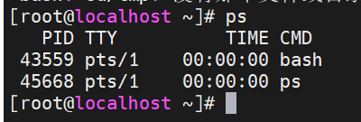
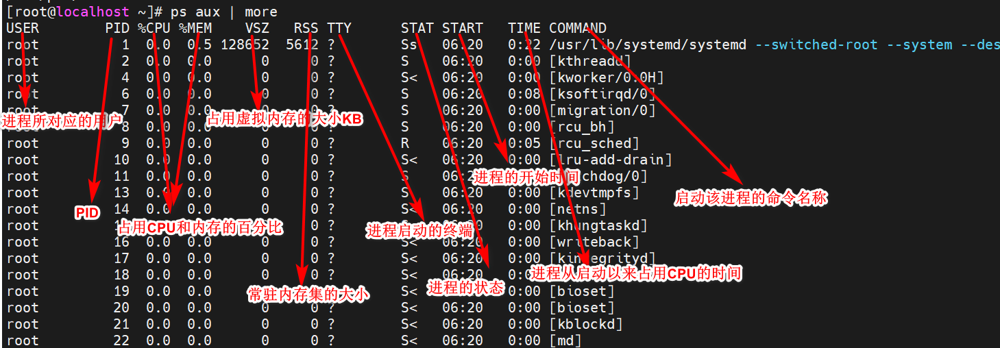
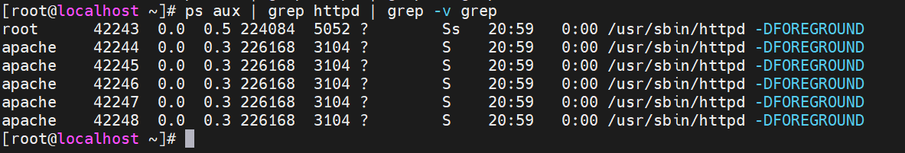
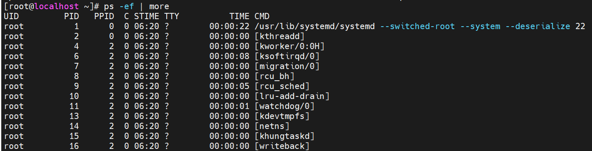
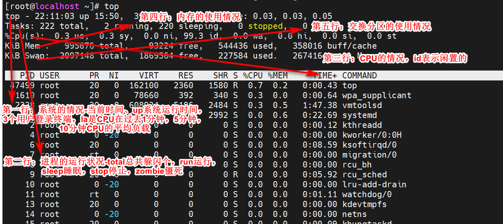
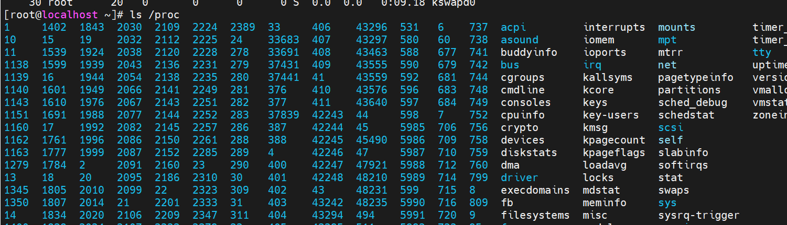
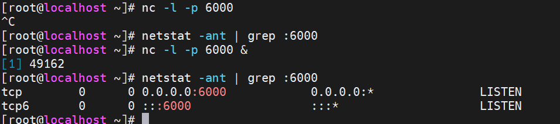
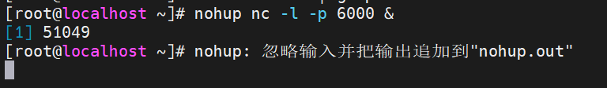
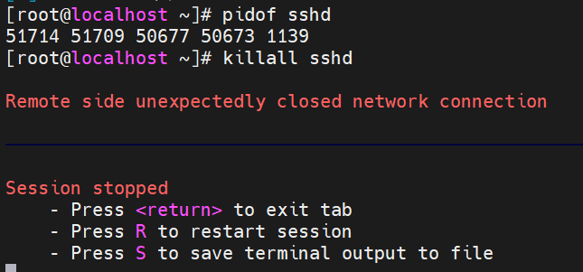
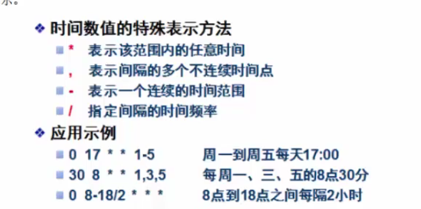

# Linux 第九章-系统进程和服务管理


## 1.管理Linux进程 

​	进程是操作系统中非常基本的概念，在系统运维管理中经常设计到对进程的管理。


### 1.1.什么是进程

​	我们在系统中运行的所有文件都是通过相应的程序来实现的，我们可以在系统中安装很多的应用程序，这些程序平时都存储在硬盘中，当要运行某个程序，就要从磁盘中调入内存中，一共CPU进行运算和处理，这下**在系统中正在运行的程序就是进程**。它们是系统正在执行的任务。

​	进程虽然也是程序，但是和程序是有区别的。程序只占用磁盘空间，不用占用系统运行空间。进程是由程序产生的，进程要占用CPU和内存等系统资源，当关闭进程后，它所占用的资源也会随之释放。

​	例如当用户打开一个文件，就会产生一个打开文件的进程，关闭文件，进程也随之关闭。另外，并非每个程序只对应一个进程，有的程序启动后可以创建一个或多个进程，例如提供Web服务的httpd程序，当它运行后，就会产生5个进程和一个管理进程，以应对大量用户的同时访问。

​	**进程也是操作系统资源分配和调度的基本单位。**Linux是一个多用户多任务的操作系统，多用户指可以在同一时间有多个用户使用同一个Linux系统；多任务是指Linux系统支持同时运行多个程序，执行多个任务。

​	当我们同时运行多个程序后，在系统中就会产生多个进程，所有的程序都是由CPU来运行和计算的，而CPU在同一时刻只能处理一个进程数据，那么如何让CPU同时处理多个进程呢？由于CPU的运行速度非常的快，因而采取的方法就是让CPU的工作时间划分为多个时间片。每个时间片很短，然后将所有的进程都放到一个队列中，操作系统会根据进程的优先级为它们轮流分配时间片，分配到的时间片的进程就可以去执行。如果时间片用完，而相应的进程还没有运行结束，那么系统就会将他们挂起并暂时放到系统后部，等到它再次轮到时间片的时候再去执行，如果进程运行结束，就将他们从队列中移除，所以操作系统中的每一个进程都是轮流执行的，因为CPU运行太快，所以用户感受不到。

​	当然上面的情况指的是单CPU的情况，但多数情况下CPU都是有多个的，那么同一时间就可以执行多个任务。


### 1.2.进程的状态

​	进程在启动后不一定马上运行，因而进程存在很多种状态。从理论上讲，进程通常会在三种状态之间进行转换：运行态、就绪态、等待态（阻塞态）：


1. **运行态：**运行态指当前进程已分配到CPU，正在处理器上执行的状态，处于运行态进程的个数不能大于CPU的数目，在一般单CPU环境中，任何时刻处于运行态的进程只能有一个。

2. **就绪态：**就绪态指进程已具备运行的条件，但因为其他进程正占用CPU，所以暂时不能运行而等待CPU的状态。一旦把CPU分给它，立即就可以运行，在操作系统上，处于运行态的进程可以有多个。

3. **阻塞态：**阻塞态指进程因等待某种事件（如等待某一输入、输出操作完成，等待其他进程发来信号等）而暂时不能运行的状态。此时即使CPU处于空闲，阻塞态的进程也不能运行，系统中处于阻塞态的进程也可以是多个。当阻塞态进程所要等待的事件发生后，就会转入就绪态。

   具体到Linux系统中，进程所处的状态更为复杂多样，系统为每种状态都定义了一个符号，以便更好的标记：

- **可运行状态R：**处于这种状态的进程，要么正在运行，要么正准备运行。也就是说，理论上处于运行态和就绪态的进程，在Linux中都被视为可运行状态。
- **可中断的等待状态S：**这类进程处于等待状态，一旦达到某种条件就会变为就绪态。
- **不可中断的状态D：**与”可中断的状态“的定义基本类似，唯一不同的是处于这个状态的进程对中断信号不做相应。比如某个进程正在从硬盘向内存中读入大量的数据时就会处于这种状态。
- **僵死状态Z：**正常情况下子进程应该由父进程结束，并释放其所占的系统资源。当某个进程已经运行结束，但是它的父进程还没有释放系统资源时，这个进程就会处于僵死状态。
- **暂停状态T：**此时的进程暂停于内存中，但不会被调度，等待接收某种特殊的处理。

### 1.3.子进程和父进程

​	除了初始进程systemd外,Linux中的每一个进程都需要由一个已运行的进程来创建，这样就构成了父进程和子进程。

​	**systemd是Linux启动的第一个进程**。系统中所有的进程都是systemd的子进程，除了systemd之外，每个进程都必须有一个父进程，父进程和子进程之间的关系是管理和被管理的关系，当父进程终止时，子进程也随之终止，但子进程终止，父进程不一定终止。

​	如果父进程在子进程结束之前就退出了，那么它的子进程就会变成孤儿进程，如果没有相应的处理机制，这些孤儿进程就会一直处于孤儿状态，资源无法得到释放。此时解决办法是在已经启动的进程里找一个进程作为这个孤儿进程的父进程，或者直接让systemd作为他们的父进程，进而释放孤儿进程占用的资源。


### 1.4.进程的属性

​	在进程启动后，**操作系统就会为进程分配一个唯一的标识符，称为进程ID(PID)。**

​	通过pidof命令就可以查询某个进程的PID：

```shell
pidof sshd										# 查看sshd服务的PID
# 37436 37431 1139
pidof systemd
# 1
```

​	PID是区别每个进程的唯一号码，**systemd进程的PID固定为1，除此之外，其他所有进程的PID都是不固定的。**当进程启动时，系统为其自动分配一个PID，进程结束时，系统就将这个PID收回。

​	出PID外，每个进程还具有以下属性：

- 父进程ID(PPID);
- 启动进程的用户ID(UID)和所属组ID(GID)；
- 进程的状态；
- 进程执行的优先级；
- 进程所连接的终端名；
- 进程资源的占用：进程占用资源的大小，如占用CPU、内存的情况。

```shell
ps -ef | more									# 查看所有进程的详细信息
```


```shell
yum install httpd -y									# 安装httpd
systemctl start httpd									# 启动httpd
ps -ef | grep httpd										# 查看关于httpd的进程
```


### 1.5.进程的分类

​	按照进程的功能和运行的程序不同，进程可划分为两大类：

- **系统进程**：可以执行内存资源分配和进程切换等管理工作，这些进程的运行不受用户的干预，即使root用户也不能干预。

- **用户进程：**通过执行用户程序、应用程序或内核之外的系统程序而产生的进程，此类进程可以在用户的控制下运行或关闭。

  针对用户进程，又分为交互进程和守护进程：

- **交互进程：**由Shell启动进程，即在中断通过输入命令启动进程。交互进程既可以在前台运行，又可以在后台运行。

- **守护进程：**一般在后台运行，通常是在Linux系统启动的同时启动，在系统关闭的同时终止。由于守护进程是一直运行的，一般所处的状态是等待处理请求任务。例如不管是否有人访问Web服务器，该服务器上的httpd服务一直运行。

## 2.查看进程的状态

​	要查看进程的状态就要使用到相关的命令去操作：

### 2.1.PS命令-查看静态的进程统计信息

​	ps(process stat)是Linux系统中标准的进程查看命令，它显示的是静态的进程统计信息，也就是执行ps命令那一刻进程的情况。使用该命令可以查看进程的运行状态、进程是否结束、进程有没有僵死、哪些进程占用了过多的资源等。

- **进程终端**：直接执行ps命令会显示当前用户在当前终端所启动的进程：

```shell
ps											# 查看启动的进程
```



​	可以看到当前只有两个进程，一个是"bash"代表当前终端所对应的进程；一个"ps"代表执行ps命令而产生的进程。

​	ps命令的选项非常的多，根据选项的组合可以分为BSD和systemV两种风格，其中BSD风格选项前一般不加"-"，而systemV则必须加"-"：

1. **BSD风格**

   ps命令使用"aux"选项可以显示系统中所有进程的详细信息，由于"ps aux"采用的是BSD风格，所以一般不加"-"。

   - **a**:显示与当前终端有关的所有进程，包括其他用户的进程；
   - **x**:显示与当前终端所有无关的进程；
   - **u:**以面向用户的格式显示进程信息(包括用户名、CPU、内存使用情况等)。

   ```shell
   ps aux | more									# 分页展示所有终端的进程
   ```

   



```shell
ps aux | grep httpd | grep -v grep					# 查看除了grep以外的httpd的进程
```



2.**systemV风格**

​	ps命令的另一组选项是"-ef"，这是标准的UNIX风格，所以前面要加上"-"。**-e:**显示系统中的所有进程信息；	**-f：**显示进程的所有信息：

```shell
ps -ef | more
```



### 2.2.top命令-查看进程的动态信息

​	若希望以动态刷新的方式查看进程信息，可以使用top命令。top命令将会以终端全屏交互式的界面显示进程排名，及时跟踪包括CPU、内存等系统资源的占用情况，默认每10秒刷新一次。

```shell
top
# 退出按q
```




### 2.3.伪文件系统/proc

​	/proc目录被称为伪文件系统，因为在该目录中存放的并不是通常意义上的硬盘中的文件或目录，而是内存中正在运行的数据。也就是说系统中所有的进程的状态信息都存放在该目录中。这也是Linux中“一切皆文件”的核心思想。

```shell
ls /proc
```



​	**里面存放的都是进程的PID。**


## 3.控制进程

### 	3.1.启动进程

​	我们之前在系统中用Shell执行的命令，都会启动对应的进程，这种方式称为手动启动进程，手动启动进程又分前台启动和后台启动。

​	前台启动是默认的进程启动方式，如用户输入"ls -l"命令就会启动一个前台进程前台进程会将执行的相关信息显示在终端上，并且在进程执行过程中占用当前终端，如果进程没有结束，用户不能再进行其他操作。

​	**如果在要执行的命令后面加上一个"&"符号，此时进程将转到后台运行。**执行结果不会显示出来，该进程也不会占用当前终端，用户仍可以执行其他操作。

```shell
ls -al > a.txt&
# [1] 48720
```

```shell
nc -l -p 6000									# 开放6000的端口，不强行终止一直在运行
nc -l -p 6000 &									# 在后台开放6000端口
netstat -ant | grep :6000						# 查看是否开放6000端口
jobs -l											# 查看哪些进程在后台执行
fg + jobs的进程编号								 # 把前台的进程移动到前台 
```




​	无论是通过在命令后面加"&"符在后台执行进程，还是通过Ctrl+Z组合键而转往后台的进程，他们都与当前终端相关。由于用户执行的命令所打开的交互进程都与终端有关，**当把终端关闭，那么该终端中的所有进程也会自动关闭。**因而如果将当前终端关闭，那么这些在后台运行的进程也会随着关闭。这样如果我们希望通过nc命令在系统终端监听TCP6000端口，这就很难实现了。

​	如果希望某些进程在后台始终运行，可以通过**nohup命令**解除其与当前终端之间的关系。比如我们希望无论当前终端是否关闭，始终都在后台执行nc命令监听本机TCP6000端口，可以执行下面的命令：

```shell
nohup nc -l -p 6000 & 										# 解除与当前终端的关系，其他终端还可以
ps aux | grep PID号 | grep -v grep
```




### 3.2.终止进程

​	如果进程是在前台运行的话，比如ping、nc等命令，那么可以用Ctrl+C组合键将其终止。如果进程是在后台运行，可以先通过fg命令将其调入前台，然后再用Ctrl+C来终止。但是Ctrl+C的组合键只能终止当前终端的的进程，如果要终止其他终端的进程，可以使用Kill命令：

```shell
# 在1号终端执行
nohup nc -lp 8000 &									# 在后台监听8000端口
# 在2号终端执行
netstat -antp | grep :8000							# 查看8000终端的进程PID
ps -ef | grep PID号									
kill PID号											# 杀死进程
netstat -antp | grep :8000							# 再次查询这个进程已经没有
```

​	kill命令通过向进程发出终止信号使其退出运行，kill发出的信号可以有多种，每个信号都有一个编号，其中默认使用的是15编号SIGTERM。**若进程已经无法响应终止信号，那么可以发出9信号SIGKILL,强行将其终止，此时就需要"-9"选项。**

​	例如：我们开启一个vim进程并将其挂载至后台，由于在没有正常保存退出的情况下，vim进程是不允许被随意结束的，所以此时不加任何选项的kill命令是无法将vim进程终止的。

```shell
vim test.txt										# 编辑末行模式下不保存按Ctrl+Z将进程转入后台
jobs -l												# 查看后台进程
kill  PID号											# 单纯用kill命令无法结束
jobs -l												# 进程仍然挂起
kill -9 PID号										# 强制杀死进程
jobs -l
```


​	除了kill命令之外，还可以使用killall命令来终止一组进程。killall命令的作用是通过程序的名字来终止这一组所有的进程。

​	比如：sshd程序的执行关联着多个进程，我们就可以使用killall命令来杀死这一组进程：

```shell
pidof sshd											# 查看sshd的所有进程pid
killall sshd 										# 终止所有sshd的进程
```

​	需要注意的是，将sshd所有的进程结束后，客户端与服务器之间的所有连接都将被断开，我们需要在服务器端重新启动sshd服务，然后再通过MobaXterm与服务器重新连接：

```shell
systemctl start sshd								# 启动sshd
```




## 4.监听系统信息

​	作为一名系统运维人员，要市场了解并掌握Linux服务器的状态、性能等详细信息。

### 4.1.监视用户信息

#### 4.1.1.users命令-查看当前登录用户名

```shell
users
# root root root
```

#### 4.1.2.who命令-查看当前系统登录用户的详细信息

```shell
who
# root     :0           2021-12-08 21:55 (:0)
# root     pts/1        2021-12-24 21:56 (192.168.80.1)
# root     pts/0        2021-12-24 21:56 (:0)
```

#### 4.1.3.w命令-who命令的升级版

```shell
w
```

#### 4.1.4.last命令-以日志方式查看登录信息

```shell
last
```


### 4.2.踢出系统中的可疑用户

​	下面已用户"jerry"为例演示如何将可以用户踢出系统。

​	首先已"jerry"用户在MobXterm上远程登录Linux系统。

​	然后再在虚拟机中执行who或w命令找到登录系统的可以用户jerry，并记录其登录的终端编号(pts/3)：

```shell
useradd jerry										# 增加用户jerry
echo '123' | passwd --stdin jerry					# 设置密码
# 在新的窗口远程登录jerry
ssh jerry@192.168.80.131
# 窗口1执行
who
ps aux | grep pts/3 | grep -v grep					# 查看可以用户登录终端的进程号pid
kill -9 55021										# 强制结束该进程	
```


### 4.3.监视资源占用信息

​	系统资源主要指CPU、内存及磁盘存储空间，管理员通过监视这些系统资源的占用信息，可以随时了解资源的消耗情况。


#### 4.3.1.查看CPU硬件信息

​	通过"cat /proc/cpuinfo"命令可以查看CPU的硬件信息

```shell
cat /proc/cpuinfo
```


#### 4.3.2.uptime命令-查看CPU的使用情况

​	执行uptime命令可以显示系统当前时间、系统已经运行了多久、当前登录用户数、CPU平均负载等信息：

```shell
uptime
```


#### 4.3.3.查看内存的硬件信息

​	可以通过如下命令查看系统内存的硬件信息：

```shell
cat /proc/meminfo
```

​	在生产过程中，我们更多的是使用free命令来查看内存的使用情况：

```shell
free -h
```


## 5.管理Linux服务

### 	5.1.什么是服务

​	服务也是一种程序，但它是一种比较特殊的程序：**服务是在系统后台运行、并等待用户或其他软件调用的一类特殊程序。**无论在哪个终端上运行一个服务，这个服务所产生的进程都与终端无关，也就是说，将终端关闭，这些服务进程仍然会在系统后台运行。

​	下面以vsftpd为例进行说明：

```shell
yum install vsftpd -y							# 安装
systemctl start vsftpd							# 启动
ps -ef | grep vsftpd | grep -v grep 			# 查看vsftpd服务所产生的进程
```


​	所谓“服务”这类程序，就是要为其他程序或者用户提供服务的，这些服务的进程要在系统后台始终运行，以随时等待被调用。Linux系统服务名称的最后一般都带有字母d，如vsftpd、httpd、sshd等,d是英文单词daemon的缩写，表示这是一种守护进程。

​	按照所服务对象的不同，Linux系统中的服务分为对内和对外两种类型。对内的服务面向的是本地计算机，主要作用是维持本地计算机的运行；对外的服务面向的是网络上的用户，主要作用是为网络中的用户提供各种功能。

​	CentOS的主要作用就是搭建各种网络服务器，而绝大多数的服务都是以服务的状态在系统中运行，所以我们**所要研究的是那些对外提供功能的网络服务。**通常情况下，**运行某种对外服务后，都会在系统中开放相应的端口。**如运行了httpd服务后会开放TCP80端口，运行FTP服务会开放TCP21端口。

​	

### 5.2.系统初始化进程systemd

​	**初始化进程是Linux系统启动是第一个被执行的程序，它需要负责启动并管理其他各种服务。**完成Linux系统的初始化工作，为用户提供合适的工作环境。

​	CentOS7系统的初始化进程是systemd，由于systemd是由系统自动在后台运行的，是一种典型的服务，因而一般也称之为systemd服务，它运行之后所产生的进程为systemd进程。systemd进程的PID永远为1，systemd进程启动之后将陆续运行系统中的其他程序，不断生成新的进程，这些进程为systemd的子进程，反过来说systemd是这些进程的父进程。这些子进程也可以进一步生成各自的子进程，依次不断繁衍下去。

​	我们可以用pstree命令查看当前进程的关系(与树状结构)

```shell
pstree
```


​	对于systemd而言，他有一个核心的概念称为单元(unit)，systemd的系统管理功能主要就是通过各种unit来实现的。每个unit都有一个相对应的配置文件对其进行标识和配置，这些配置文件主要存放在/usr/lib/systemd/system/和/etc/systemd/system/目录中。

​	systemd的unit分为多种类型，其中最为重要的是对服务进行管理的Service unit(服务单元)，系统中的每一种服务都会有一个与之相对应的服务单元，这类unit的配置文件通常以".service"作为后缀。执行如下命令可以查看到/usr/lib/systemd/system/目录中存在大量后缀.service的unit文件。

```shell
ls /usr/lib/systemd/system/*.service
```


​	除了Service unit之外，还有一类比较重要的unit叫Target unit(目标单元)，这些unit配置文件以".target"作为文件后缀名，主要用于模拟实现系统运行级别。查看".target"的文件：

```shell
ls /usr/lib/systemd/system/*.target
```

​	除此之外，systemd的uint还包括Device unit(设备单元)，用于定义系统内核需要识别的设备。Mount unit(挂载单元)，用于定义文件系统挂载点。Socket unit(套接字单元)，用于标识进程间通信用的socket文件，除此之外，还有很多unit，这些unit并不常用，因而就不一一介绍了。  

### 5.3.管理服务运行状态

​	在CentOS5和CentOS6系统中对服务的管理主要是通过service和chkconfig命令完成的。在CentOS7中主要是通过systemd中的systemctl工具来对服务进行管理。systemctl是systemd提供的一个重要的管理工具，集service和chkconfig等众多的功能集于一体。

​	利用systemctl命令管理服务运行状态的语法格式为：

```shell
systemctl start|stop|status|restart|reload 服务名
```

​	**其中"start"表示开启服务，"stop"表示关闭服务，"status"表示查看服务的运行状态，"restart"表示重启服务，"reload"表示重新加载服务。**

​	下面以vsftpd服务为例：

```shell
yum install vsftpd -y
systemctl status vsftpd
systemctl stop vsftpd
systemctl start vsftpd
```

​	我们可以执行执行如下命令查看系统中所有正在运行的服务。

```shell
systemctl list-units --type=service
```


### 5.4.管理服务启动状态

​	我们还可以用systemctl命令来管理服务的启动状态。

​	利用systemctl命令来管理服务启动状态的语法：

```shell
systemctl enable|disable|is-enabled 服务名
```

​	其中，enable表示将服务设置为开机自启动，disable表示禁止开机自启动，is-enable表示查看服务的启动状态。

​	下面以vsftpd服务为例介绍：

```shell
systemctl is-enabled vsftpd
systemctl enable vsftpd
systemctl is-enabled vsftpd
systemctl enable vsftpd
```


## 6.管理系统运行级别

### 6.1.设置运行级别

​	Linux系统在启动过程中所要运行的服务或程序都是由初始化进程来负责启动的，但是当我们有不同的工作需求时，可以需要启动的服务也会有所区别。对于我们熟悉的Windows系统，在正常启动模式下，所有被设为开机自启动运行的服务或程序都会被自动启动，但如果时进入安全模式，那么就只会启动系统最基本的程序以及微软官方服务，其他非必要的程序以及非微软的服务都将不被运行。在Linux系统中也采用了类似机制，**它将在系统运行时需要启动的各种服务程序相互组合构成不同的搭配关系，**以满足不同的系统需求。**对于传统的init初始化进程，将这种服务的关系称之为运行级别RunLevel，而对于systemd初始化进程，则称之为目标(target)。**

​	无论”运行级别“还是”目标“，他们所实现的功能是一致的。在systemd中使用5种目标来对应7种运行级别，从而实现向后兼容。他们所对应的关系和功能如下表：

| init运行级别 | systemd目标名称                      | 作用             |
| ------------ | ------------------------------------ | ---------------- |
| 0            | runlevle0.target   poweroff.target   | 关机             |
| 1            | runlevle1.target  rescue.target      | 单用户模式       |
| 2            | runlevle2.target   multi-user.target | 等同于级别3      |
| 3            | runlevle3.target   multi-user.target | 多用户的字符界面 |
| 4            | runlevle4.target                     | 多用户的字符界面 |
| 5            | runlevle5.target graphical.target    | 多用户的图形界面 |
| 6            | runlevle6.target reboot.target       | 重启             |

​	在这7种运行级别种，最常用的是3和5，即"multi-user.target"和"graphical.target"，分别代表字符界面和图形界面。用如下命令查看系统的默认级别：

```shell
systemctl get-default
# graphical.target
```

```shell
runlevel											# 查看当前系统的运行级别
# 5表示当前所处的级别是5，N表示之前未切换过运行级别
```

​	使用init命令可以切换系统的运行级别，init需要使用到与运行级别相对应的数字(0-6)作为命令参数，例如将运行级别由图形模式5切换到字符模式3：

```shell
init 3												# 切换为字符界面
free -h												# 查看内存占用情况
init 5												# 切换图形界面
free -h 											# 可以发现图形界面更占用资源
# 切换运行级别可以观察虚拟机的切换变化
```

​	除了用init的方式更改系统的运行级别，还可以用systemctl set-default+ 运行级别的方式来更改：

```shell
systemctl set-default multi-user.target			# 更改运行级别
systemctl get-default
runlevel										# 查看运行级别
```

​	通过以上内容的学习，在实际生产过程中，为了不消耗过多的资源，**大多数情况下系统的运行级别都是被设置为3(multi-user.target).**


### 6.2.重置root用户的密码

​	在使用系统的过程中，我们可能不慎忘了管理员的密码，那么此时该如何重置管理员账号密码呢？一种方式是我们可以将运行级别设置为1(单用户模式)，这样系统就只能root用户来登录了，而且无需密码，这样就可以重置root密码了。另一种方式是通过救援模式来进行密码重置，救援模式是Linux系统提供的类似Windows系统的WinPE的系统维护环境，无论是单用户模式还是救援模式都只能是在系统本地登录时才能使用，而无法通过网络远程操作，这样的设计无疑是处于对于安全方面的考虑。

​	要进入救援模式，首先需要将系统重启，并在引导界面中快速移动上下方位键，避免进入系统，而是停留在引导界面中，然后将光标定位在第一行，并按"e"键进入到引导菜单编辑界面，在linux16这一行后添加rd.break，然后按Ctrl+X键重启系统进入救援模式：


​	重启后一次输入以下命令，等待系统重启之后即可使用新密码root来登录：

```shell
mount -o remount,rw /sysroot					# 将根目录重写挂载到读写模式
chroot /sysroot									# 切换到根目录
LANG=en											# 将语言设置为英文，否则会乱码
passwd root										# 修改并确认密码
touch /.autorelabel								# 重新加载SELinux标签
exit											# 退出
reboot											# 重启
```


### 6.3.管理计划任务

​	计划任务可以让系统在指定时间内自动执行预先计划好的任务。在对Linux系统进行管理和维护的过程中，有时会进行一些比较费时而且占用资源较多的操作，为了不影响正常的服务运行，通常都将这些操作安排在深夜由系统自动去运行，此时就可以通过设置计划任务，让系统在指定时间内完成指定的操作。

​	Linux系统提供了两种计划任务：一种是执行一次的at计划任务，一种是周期性执行的cron计划任务。


#### 6.3.1.配置at一次性计划任务

​	使用at计划性任务之前需要确保atd服务是开启的，否则计划任务不会被执行。在CentOS7中，atd是被作为系统服务自动运行的。

```shell
systemctl status atd								# 检测atd服务的状态
```


​	at命令的语法：

```shell
at 任务执行时间
at>任务1
at>任务2
at>.....Ctrl+D保存退出
```

​	用at命令定时输出Hello World：

```shell
at 15:41
at>echo "Hello World"
```

​	实际上定时任务是不会在屏幕上显示出来的，它会以邮件的方式发送给你，执行mailx然后输入邮件编号就可以显示执行的明细：

```shell
mailx												# 查看CentOS邮件中心邮件
```


​	**at命令的常用选项：**

- **-l:**将定时任务列表显示出来；

- **-d:**删除指定的计划任务，后面加任务编号；

- **-c:**查看任务的具体内容，后面加任务编号。

  at命令可以使用的日期格式有很多种，常见的有以下几种：

- HH:MM [YYYY-mm-dd]:at 16:00 2021-12-26;

- tomorrow: at 10:00 tomorrow;

- now+#:#可以由minutes、hours、days等替代，at 16:00+3days----3天后的16:00执行计划任务。


#### 6.3.2.配置cron周期性计划任务

​	在更多情况下，我们可能都需要周期性的执行某一项任务，所以相对应at计划任务，cron周期性计划任务更加常见一些。

​	cron功能由crond服务所提供，这也是一个自动运行的系统服务：

```shell
systemctl status crond
```


​	设置cron周期性计划任务用crontab命令，并加上-e选项设置任务：

```shell
crontab -e 											# 进入编辑模式编辑计划任务
```

​	设置周期性任务需要遵循以下格式：


```shell
crontab -e								# 按enter键再按i进入插入模式插入示例内容
25 14 29 12 3 /usr/bin/cat /etc/passwd	# 12月29号周三14：25分查看/etc/passwd
```

​	**需要注意的是，在脚本里面是不能直接输入命令的，而是需要加上命令的全路径名，我们可以执行which命令查看命令的全路径：**

```shell
which cat
# /usr/bin/cat
```

​	查看cron周期性计划任务可以用-l选项：

```shell
crontab -l
```

​	以上设置方法具体的日期不一定能够重复，我们可以采用通配符*来设置周期性任务,比如我们要想每天00：00执行某个任务，我们可以这样写：

```shell
00 00 * * *  任务
```



​	清除周期性计划任务可以用-r选项：

```shell
crontab -r									# 删除周期性任务
```

​	重要的配置文件常常都会定期打包备份，并加上备份的时间，格式如下：

```shell
0 19 * * * /usr/bin/tar -zcf /root/etc-$(date+/%F).tar.gz   /etc
```

​	需要注意的是"%"有特殊的含义，所以用到"%"是需要加上"/"进行转义。

​	我们也可以添加"-u"选项给某一用户设置计划任务：

```shell
crontab -e -u student 						# 给student用户设置计划任务
```


## 7.生成UUID

```shell
cat /proc/sys/kernel/random/uuid | sed 's/-//g'
linux内核是有uuid生成接口的，读取文件就可以生成一个uuid
```

