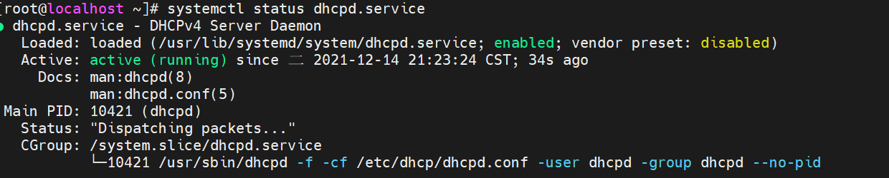

# Linux 第九章

# 配置与管理DHCP服务器

## 1.什么是DHCP

​	DHCP是Dynamic Host Configuration Protacol（动态主机配置协议）的缩写，主要作用是为网络客户机自动动态的分配IP地址。

使用DHCP时，在网络上至少要有一台DHCP服务器，当网络中的DHCP客户端程序发出请求获取IP地址的信息后，DHCP服务器会根据目前已经配置的地址池，提供一个可供使用的IP地址和子网掩码给DHCP客户端。


## 2.DHCP服务器工作流程

​	DHCP客户机和服务器交互，有客户机通过广播的方式向服务器发起申请IP地址的请求，然后由服务器分配一个IP地址及其他TCP/IP设置信息。主要分为这六个步骤：

1. IP地址租用申请；
2. IP地址租用提供；
3. IP地址租用选择；
4. IP地址租用确认；
5. 更新租用；
6. 释放IP地址租用。

## 

## 3.DHCP服务器的安装

​	在配置使用DHCP前，建议使用如下命令查询检测系统是否安装了DHCP服务器相关软件包：

```shell
rpm -qa | grep dhcp
```

​	如果系统没有安装，可以使用yum方式安装：

```shell
yum clean all
yum -y install dhcp
```


## 4.启动DHCP服务器

​	1.在启动DHCP服务器之前，我们可以先查询DHCP服务器的运行状态，查询命令如下：

```shell
systemctl status dhcpd.service
```


​	Active状态为inactive(dead)，表示服务未启动。

​	2.启动服务

```shell
systemctl start dhcpd.service
# 重启
systemctl restart dhcpd.service
```

​	3.停止服务

```shell
systemctl stop dhcpd.service
```

​	4.设置开机自启动

```shell
systemctl enable dhcpd.service
```

## 5.配置DHCP服务器

​	在安装完dhcp后需要将IP和子网掩码设置后才能启动，设置的文件为dhcp的配置文件，DHCP的配置文件为/etc/dhcp/dhcpd.conf，但该文件没有任何的配置信息。需要将/usr/share/doc/dhcp*/dhcpd.conf.example文件复制到/etc/dhcp/dhcpd.conf。

```shell
ls /usr/share/doc | grep dhcp					# 查看/usr/share/doc下dhcp的文件
cp /usr/share/doc/dhcp-4.2.5/dhcpd.conf.example  /etc/dhcp/dhcpd.conf			# 复制文件到/etc/dhcp/
```


​	**复制完成后，需要编辑这个配置文件的IP及子网掩码：**

```shell
vim /etc/dhcp/dhcpd.conf
```


​	设置完成后我们就可以执行开启DHCP服务器的操作：

```shell
systemctl start dhcpd.service					# 开启服务
systemctl enable dhcpd.service					# 设置开机自启动
systemctl status dhcpd.service					# 查看运行状态
```



## 6.删除DHCP安装包

​	如果要删除DHCP安装包可以使用rpm命令来执行：

```shell
rpm -e dhcp-4.2.5						# 删除dhcp安装包
rpm -qa | grep dhcp						# 查看安装包是否删除
```


