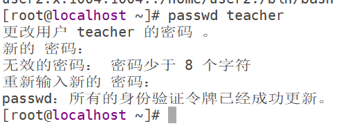
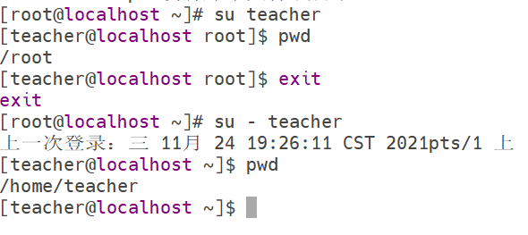
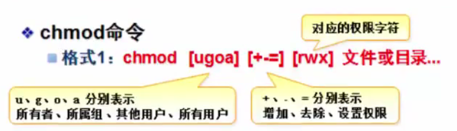
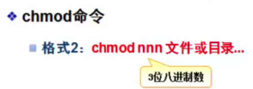
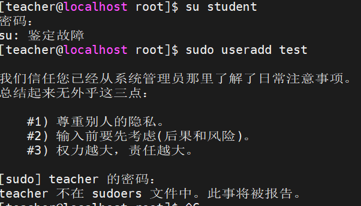

#   Linux 第六章 

# 用户、组和权限管理

## 1.了解用户和组的概念

​	当我们要登录系统或访问系统的某个资源时，通常都要求输入用户名和密码，从系统的角度看，用户就是一种进行认证或授权的标识。只有通过认证的用户才能访问相应的资源，而对于同一个资源，不同的用户又有不同的访问权限。比如要在公司网络中配置一台网络服务器，只允许本公司的员工才能从服务器上浏览和下载文件，而且只允许行政部员工对文件的内容进行修改。这些都是在系统运维中经常遇到的问题。而解决这些问题我们都要用到用户和组。

### 1.1.用户和组的基本概念

1. ​	**用户账号的类型**

   在Linux系统中，根据系统管理的需要将用户账户分为三种类型：超级用户、普通用户、系统用户。

   - 超级用户：root是系统的超级用户，使用该账号，管理员可以突破一切限制，方便系统的维护。由于root权限太大，所以不建议用root直接登录，而是采用普通用户登录，需要进行权限维护时才切换至root登录。
   - 普通用户：该账户需要由root或其他管理员创建，一般只在用户的家目录拥有全部权限。
   - 系统用户：这类用户最大的特点是不能登录系统。而主要是让后台进程以非管理员的身份运行。它们大都是在安装系统是自动添加的。
   
2. 用户组的类型

    	在Linux系统中，每个用户账号至少属于一个组，这个组称为该用户的基本组。与Windows不同的是，**在Linux中创建一个用户账号，就会自动创建一个与该账号同名的组。**比如我们创建了一个student用户，就会自动创建一个student的用户组。

   ​	在Linux系统中，每一个用户可以同时加入多个组，这些用户又另外加入的组叫附加组。

3. UID和GID

   ​	UID(User Identifier,用户标识符)，是系统中每一个用户的唯一标识符，对于系统核心来说，UID是区分用户的基本依据，root用户的UID固定为0,系统用户的账号为1-999之间，1000-60000的账号被划分给普通用户。

   ​	每一个组也有一个数字形式的标识符-GID(Group Identifier,组标识符)。它们的分组标号和UID一样。

   ​	需要注意的是，Linux系统也只是识别UID和GID来区分用户的组，至于用户名和组账号是方便人们记忆而已。

4. 利用id查看用户信息

   ```shell
   id student									# 查看student用户的基本信息
   # uid=1002(student) gid=1002(student) 组=1002(student)
   # gid表示用户所属的基本组，组表示用户所属的基本组和附加组
   -----------------------------------------------
   # 如果想让用户加入其他附加组，可以执行如下命令
   gpasswd -a student root						# 将student加入到root组
   ```

5. 用户账号文件:/etc/passwd

   该文件的组成：

   ```shell
   用户:密码占位符:UID:GID:描述信息:家目录:用户所使用的shell命令
   ```

6. 用户密码文件:/etc/shadow

   ​	由于/etc/passwd是所有用户可读的，这样就导致了用户和密码容易被泄露，因此Linux将用户的密码信息从/etc/passwd中分离出来，单独放在了/etc/shadow文件中。该文件又被称为影子文件，只有root用户拥有权限，从而保证用户密码的安全性。

   ​	我们可以看到之前通过useradd命令添加的用户student和teacher还没有设置密码，我们可以通过如下命令来设置密码：

   ```shell
   passwd student								# 为student用户设置密码
   ```

   ​	我们可以从该文件看到，密码都是通过加密处理的。我们常用的加密方式有两种：MD5和SHA。在Linux系统中使用SHA的加密方式加密。

   ```shell
   echo -n '123' | md5sum							# 将123采用md5的方式加密
   echo -n '123' | sha1sum							# 将123采用sha的方式加密
   # 这两种就加密方式的区别是MD5加密成128位的字符-32个字符，SHA加密成160位的字符-40位
   ```

   ​	/etc/shadow文件中包括9个配置字段，其中第一个字段表示用户名，第2个字段表示使用HASH加密的密码。密码由"$"分成3部分：

   - 第一部分"$6"：表示所采用的加密方式，Linux所提供的加密方式由md5,sha1,sha224,sha256,sha512等，"$6"对应的是sha512的加密方式；

   - 第二部分：是在密码中加入随机数salt,它的作用是防止用户使用相同的密码，而导致加密后的密码串也相同；

   - 第三部分：密码加密后的密码串，但是这些密码串都是通过重新编译后再存放的。

     后面的数字表示密码最后一次更改距计算机元年的天数

     ```shell
     echo $[18952/365]
     ```

### 1.2.用户和组的操作

#### 	1.2.1.创建用户

​	

```shell
useradd 用户									# 新增用户
# 通过创建用户，设计到更改的目录有/etc/passwd  /etc/shadow  /etc/group  /etc/gshadow
  /home   /home/用户
```

**useradd命令常用选项：**

- **-u选项：给用户指定一个UID，要求该UID未被其他用户占用。**

```shell
useradd -u 1004 user2						  # 创建user2的用户并指定UID位1004
tail -1 /etc/passwd
# user2:x:1004:1004::/home/user2:/bin/bash
```

- **-d选项：指定用户的家目录**

普通用户的家目录都是指定在/home目录下，我们可以通过-d选项指定到某一目录下。

```shell
useradd -d /admin admin						# 创建一个admin用户到/admin目录 
```

- **-g选项：指定创建用户的基本组**

```shell
useradd -g admin user3						# 创建user3用户并指定admin的用户基本组-不会创建user3组
tail /etc/group								# 查看组文件并没有user3用户基本组
```

- **-G选项：指定创建用户附加组**

```shell
useradd -G admin user4						# 创建user4并指定附加组admin
id user4									# 创建了user4的基本组，并归于admin的附加组
```

- **-e选项：指定用户账号的失效时间，可使用yyyy-mm-dd的日期格式**

```shell
useradd -g users -e 2021-11-11	temp01		# 创建一个2021-11-11失效的的用户temp01并指定users用户组
```

#### 1.2.2.passwd命令-修改密码

​	在Linux系统中我们需要定期的修改密码来确保账户的安全性

​	**语法：**

```shell
passwd 用户名
```



注意：**只有root用户才能修改所有用户的密码，只有本用户才能修改自己的密码。**

- **-d选项：清除密码**

```shell
passwd -d user1										# 清除密码
```

​	用户的密码被清除后，无需使用密码就可以实现本地登录，但远程登录始终是需要密码的。

- **-l选项：锁定用户账号-使其不能登录**

```shell
passwd -l user2										# 锁定user2用户-不能登录
```

- **-u选项：解锁用户**

```shell
passwd -u user2										# 将用户user2解锁
```

- **--stdin选项：从文件或管道读取密码**

  由于在用passwd密令设置或修改密码时，需要用户反复进行确认，而这很难复合自动化运维的需要，因而在实际操作中，**需要使用--stdin选项与管道配合，从而自动化完成密码设置。**

```shell
echo '123' | passwd --stdin user1							# 无需确认，直接为user1设置密码
```

#### 1.2.3.su命令-切换用户命令

​	切换用户身份可以使用su(switch user)命令来实现，基本格式为：

```shell
su [-] [用户名]
```

​	如果不加"-"，工作目录还在原来的目录，如果加了"-"就变成了切换后用户的家目录



​	需要注意的是，从管理员切换到普通用户不需要输入密码，从普通用户切换到管理员需要输入密码。

#### 1.2.4.usermod命令-切换用户的属性

​	对于系统已经存在的用户账号，如果要修改其属性信息可以直接编辑/etc/passwd文件中的相关数值，也可以使用usermod(user modify)命令重新设置。

​	usermode和useradd命令的选项基本一致。

- **-m,-d选项：修改用户的家目录**

  ```shell
  usermod -m -d /home/admin admin				# 将admin的家目录移动到/home/admin下
  ```

- **-l选项：更改用户的账号名称**

  ```shell
  usermod -l master admin						# 将admin用户的账号改为master
  grep master /etc/passwd
  ```

- **-g选项：更改用户的基本组**

  ```shell
  usermod -g ftp master						# 将master的基本组改为ftp
  id master
  ```

- **-G，-a选项：更改用户的附加组**

  ```shell
  usermod -G root master						# 将master用户附加组改为root
  ```

  用这个选项修改附加组会将之前的附加组清空并重新设置。如果需要保留之前用户的附加组，那么就需要结合-a选项。

  ```shell
  gpasswd -a student root						# 将student加入到root组
  usermod -a -G ztr student					# 将student加入到ztr附加组，并且不覆盖之前的
  id student
  ```

  

### 1.3.用户组的管理

#### 1.3.1.用户组的配置文件

​	与组账号相关的配置文件有两个：/etc/group，/etc/gshadow。前者保存组账号名称、GID、组成员等基本信息，后者用于保存组账号的加密密码字符串等信息。

​	

```
grep "^root" /etc/group							# 查看root组的信息	
# root:x:0:student
```

- 第一个字段：组名
- 第二个字段：组密码占位符x
- 第三个字段:GID
- 第四个字段：以改组为附加组的用户列表，注意，**以该组为基本组的账号不会显示。**

#### 1.3.2.groupadd命令-创建用户组

```shell
groupadd class3									# 创建class3的用户组
tail -1 /etc/group
```

- **-g选项：指定GID号**

  ```shell
  groupadd -g 2000 class2						# 创建用户组，并指定GID为2000
  tail -1 /etc/group
  ```

#### 1.3.3.gpasswd命令-添加、删除组成员

​	gpasswd命令本来是设置组账号的密码，但是该功能极少使用，实际上该命令更多的是添加、删除组成员，对应的选项为-a、-d。

**格式：**

```shell
gpassswd [选项] 用户名 组名
```

​	**注意：gpasswd命令改变的是用户的附加组，将用户加入到某个组之后，该组将称为一个用户的附加组。**

```shell
gpasswd -a student teacher						# 将student用户加入到teacher组
id student										# 基本组不变

---------------------
gpasswd -d student teacher						# 将student从teacher组删除
```


#### 1.3.4.groupdel命令-删除用户组

​	如果要删除的组是某些用户的基本组，那么就得先删除这些用户，才能删除用户基本组。

```shell
gpasswd -a super class1							# 将class1设为super的附加组
groupdel class1									# 删除class1用户组
-------------------------
usermod -g class2 super							# 将class2设为super的基本组
groupdel class2									# 此时无法删除
usermod -g admin super							# 将admin设为super的基本组
groupdel class2									# 此时才能删除
```


## 2.管理文件和目录的权限及归属

​	能够根据各种需求来进行准确的权限设置，这是一名Linux运维人员必须要掌握的基本技能。


### 2.1.权限与归属的概念

​	Linux系统中的每一个文件或目录都被赋予了两种属性：访问权限和文件所属者，简称“权限”和“归属”。

​	访问权限分为读取、写入、可执行三种基本类型。归属包括所有者、所属组。

**访问权限：**

- **读取：**允许查看文件内容，显示目录列表-read-r；
- **写入：**允许修改文件内容，允许在目录中新建、删除、移动目录或文件-write-w；
- **可执行：**允许切换程序、切换目录-execute-x。

**归属：**

- **所有者**：	拥有该文件或目录的用户账号；
- **所属组：**拥有该文件或目录的组账号。

在Linux中，**由于root是超级用户，拥有完全的管理权限，因此，对文件、目录的权限设置对root不起作用。**

对文件：

```shell
./test.sh											# 执行脚本
cp test.sh test2.sh									# 复制并改名test2.sh
chmod -x test2.sh									# 取消执行权限x
./test2.sh
# -bash: ./test2.sh: 权限不够
ll test2.sh
# -rw-r--r--. 1 root root 21 12月  1 21:16 test2.sh -我们可以看到只有rw读写的权限，没有执行的权限
ll test.sh
# -rwxr-xr-x. 1 root root 21 10月 29 15:06 test.sh
```

对目录：

```shell
mkdir /tmp/test
ll -d /tmp/test
# drwxr-xr-x. 4 root root 46 10月 29 20:45 /tmp/test
第一组rwx表示所有者对应的权限
第二组r-x表示所属组对应的权限
第三组r-x表示其他用户的权限
chmod 750 /tmp/test								# 修改权限
ll -d /tmp/test
# drwxr-x---. 4 root root 46 10月 29 20:45 /tmp/test
echo 'Hello' > /tmp/test/test.txt 				# 生成text.txt并写入内容
# 在窗口2中用其他用户登录再查看此文件会显示权限不够
cat /tmp/test/test.txt
# cat: /tmp/test/test.txt: 权限不够
# 在窗口1中修改该文件的权限
chmod 755 /tmp/test
# drwxr-xr-x. 4 root root 62 12月  1 22:27 /tmp/test--其他用户有了读和执行的权限
# 在窗口2执行
cat /tmp/test/test.txt
# Hello
```


### 2.2.设置文件或目录的权限

​	通过chmod(change mode)命令可以设置更改文件或目录的权限，只有文件所有者或root用户可以使用该命令来改变文件或目录的访问权限。

​	chmod命令设置权限时，可以采用两种不同的权限表示方式：字符形式、数字形式。

#### 2.2.1.字符形式的chmod命令



```shell
ll -d /tmp/test								# 查看test文件的权限
drwxr-xr-x. 4 root root 46 10月 29 20:45 /tmp/test
chmod o-w /tmp/test							# 去除其他用户的写的权限
ll -d /tmp/test								
# drwxr-xr-x. 4 root root 62 12月  1 22:27 /tmp/test
chmod g+w /tmp/test							# 给所属组添加写入权限
chmod a-w /tmp/test							# 给所有用户取消写的权限
chmod u=rwx /tmp/test						# 给所有者增加所有权限
chmod o=--- /tmp/test						# 取消其他用户的所有权限
```

#### 2.2.2.数字形式的chmod命令

​	

​	"nnn"表示3为八进制的数值，r、w、x可以分别用八进制数字4、2、1来表示。表示一个权限组合时需要将数字累加。如："rwx"采用数值表示就是“7”，“r-x”就是“5”，而"rwxr-xr-x"就可以用”755“来表示。

```shell
chmod 755 /tmp/test							# 将权限改为rwxr-xr-x
ll -d /tmp/test
chmod 750 /tmp/test							# 让其他用户没有任何权限
```


## 3.系统高级权限设置

​	系统高级权限分为访问控制列表facl、SUID,SGID,StickyBit等特殊权限设置


### 3.1.facl配置文件访问控制符

​	用chmod用户设置权限都是针对某一类用户，当我们需要对某一指定用户设置权限时，就需要文件访问控制符来实现。

​	facl(File Access Control Lists)专门来完成这种细部权限设置。

**facl格式：**

```shell
setfacl [选项] 设置值 文件名
getfacl 文件名						# 查看设置的acl
```

**选项：**

- -m:设定facl规则；
- -x:取消一个facl规则；
- -b:取消全部facl规则。

**设置完acl规则后会多出一个"+"，代表文件启用了facl规则。用facl设置权限的用户的优先级要高于设置的用户。**

```shell
mkdir /home/project/
chmod 770 /home/project/
setfacl -m teacher:rwx /home/project/					# 给teacher用户增加所有权限
ll -d /home/project/

# 在窗口2中su teacher查看权限
 ll -d /home/project									# 查看权限
 echo "Hello" > /home/project/teacher.txt				# 能够写入内容
```

```shell
# 管理acl规则
setfacl -m u:teacher:r-x /home/project					# 更改teacher用户权限为r-x
getfacl /home/project									# 查看acl 
setfacl -x u:teacher /home/project						# 取消teacher用户的权限
```

### 3.2.设置特殊权限

​	设置特殊权限分为：SET位权限(SUID,SGID)，粘滞位权限(Sticky Bit).


#### 3.2.1.SET位权限

​	SET位权限是除了读、写、执行之外的附加权限，权限字符为“s”，**SET位权限一般都是针对可执行程序或者目录设置。**SUID表示对所有用户添加SET位权限，SGID表示对所属组添加SET位权限。

​	设置SET位权限同样需要通过chmod命令来实现。可以使用"u+s"，"g+s"的权限模式分别设置SUID和SGID。

​	**设置SUID的作用是让执行该文件的用户自动拥有所有者的权限。**

```shell
ll /usr/bin/passwd
# -rwsr-xr-x. 1 root root 27856 4月   1 2020 /usr/bin/passwd
# 可以看到多了一个s
```

```shell
# 用teacher用户在窗口2去查看密码文件显示没有权限
cat /etc/shadow										# 普通用户不能查看
# cat: /etc/shadow: 权限不够

# 要想普通用户具有查看的功能就需要设置cat的SUID
ll /usr/bin/cat
# -rwxr-xr-x. 1 root root 54080 8月  20 2019 /usr/bin/cat
chmod u+s /usr/bin/cat						# 给所有者设置set权限
ll /usr/bin/cat
-rwsr-xr-x. 1 root root 54080 8月  20 2019 /usr/bin/cat

# 用teacher用户在窗口2去查看密码文件就可以查看了
cat /etc/shadow	

chmod u-s /usr/bin/cat						# 取消所有者的set权限
```

​	**设置SGID表示给所属组设置SET位权限。**但它对文件和目录的操作是不一样的：

- 文件：如果针对文件设置SGID，则不论使用者是谁，他在执行该程序时都将以文件所属组成员的身份去执行；
- 目录：针对目录设置SGID，则在该目录内建立的文件或子目录的所属组，将会自动称为此目录的所属组。

**SGID通常用于设置目录的权限。**

```shell
chmod g+s /home/project/					# 给所属组设置SGID
ll -d /home/project/
# drwxrws---+ 2 root root 25 12月  2 10:20 /home/project/
```

**SGID一般用于协同办公，位目录设置SGID权限后，那么用户在该目录创建的文件都将属于同一个用户组，这样该组的成员都将自动拥有文件的相应权限。**


## 4.sudo命令提升权限

​	**sudo命令的作用主要在于能够允许经过授权的个别普通用户以root权限执行一些授权使用的管理命令。**

```shell
# 在窗口2中用teacher来创建用户
useradd test										# 普通用户创建用户会显示权限不够
sudo useradd test									# 加上sudo命令后就可以执行
```



创建好会提示说teacher不再sudoers中，是因为teacher用户没有得到root用户的授权，如果要想得到授权只需要用root用户修改/etc/sudoers文件。

```shell
vim /etc/sudoers
#进入该文件后输入:set nu设置行号，在文件末尾添加如下内容
teacher ALL=ALL
```

**添加完内容后需要执行强制退出":wq!"**。


## 5.练习

```shell
1.从/etc/group文件中找出含有wheel的行
2.从Linux系统存放用户信息的文件中找出root用户信息，并存放到root.txt文件中
3.假设你不知道httpd.conf在什么目录下，如何准确的查找出来--
4.创建一个用户temp，并指定UID为1500
5.查看student用户的基本信息
6.在vi编辑器中删除一行-dd
7.将当前用户身份切换到teacher
8.创建test01用户，并将root组设为test01的基本组
9.创建一个用户访问FTP的用户ftpuser，并禁止其访问
useradd -s /sbin/nologin ftpuser
10.通过非交互方式为ftpuser设置密码123456
11.在/tmp目录下创建目录tmp01，给这个目录设置所有人都有读写的权限，而没有执行权限
12.用teacher用户创建用户007
```

