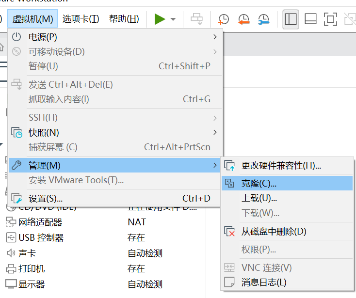
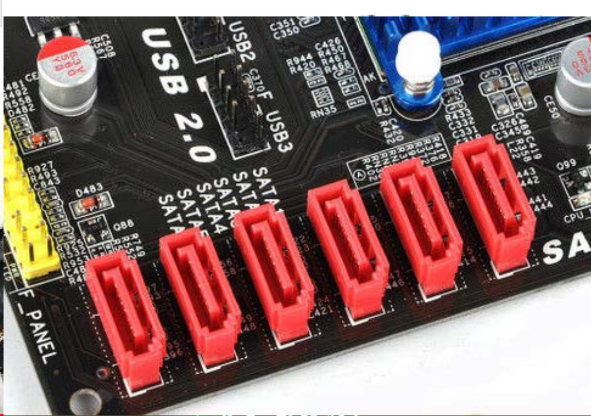
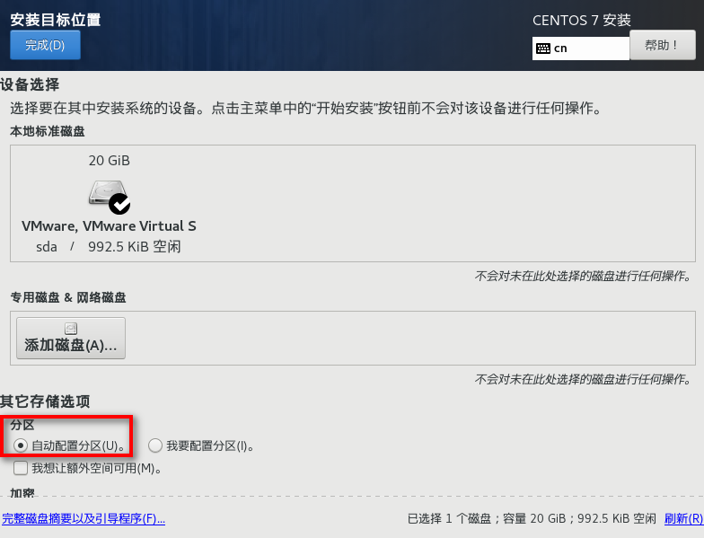
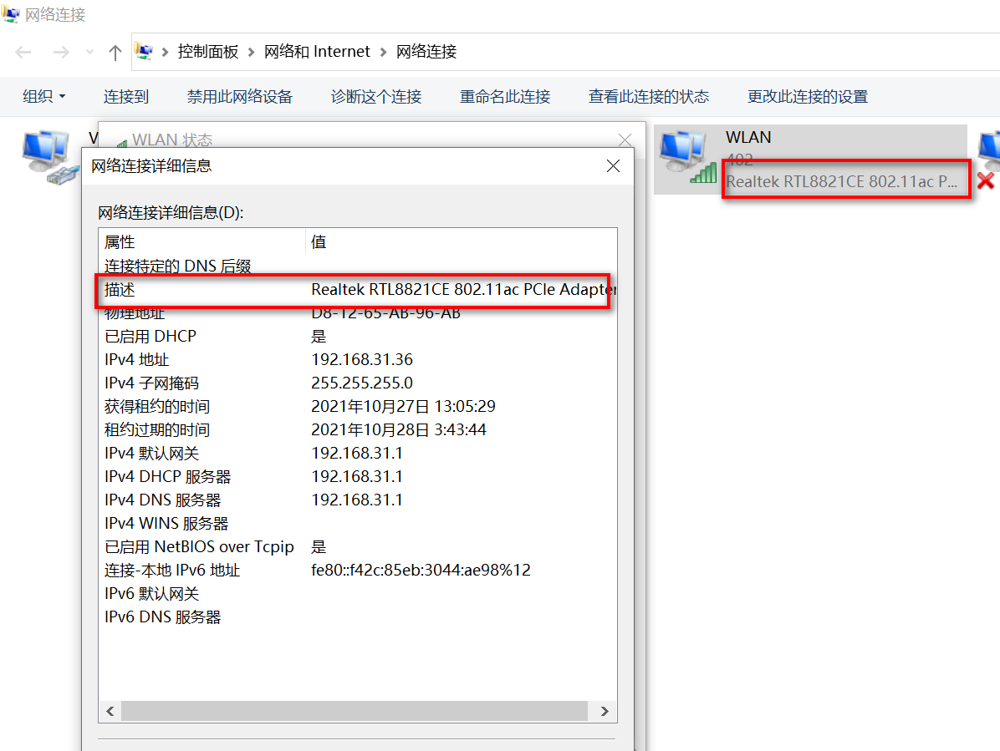

#  Linux第二章


## 第二章.Linux系统的安装

### 1.VMware简介

VMWare是一个虚拟PC的软件，可以在现有的操作系统上虚拟出一个新的PC环境，相当于模拟出一台PC环境，以此来实现一台机器上真正同时运行两个独立的操作系统。

VMWare官方网站：https://www.vmware.com/


### 2.VMWare的特点

- 不用分区或重新开机就能在同一台PC上使用两种操作系统；
- 本机系统可以与虚拟机系统实现网络互通；
- 可以设定并且随时修改虚拟机操作系统的硬件环境。


### 3.VMWare的建议配置

- CPU：建议主频在1GHZ以上；
- 内存：最少512M，建议至少1GB以上；
- 硬盘：建议至少1GB；
- 显卡：VGA兼容显卡。


### 4.VMWare下载

1. 访问官网：https://www.vmware.com/cn.html

   没有注册的情况下需要先注册：https://my.vmware.com/cn/web/vmware/registration

   

2. 在下载资源页搜索VMWare workstation进行下载


### 5.VMWare安装

- 双击打开安装包，点击下一步：


- 选中协议条款，点击下一步


- 更改安装位置，选择第一个选项增强键盘驱动程序


- 取消默认勾选项，点击下一步


- 创建桌面快捷键和开始菜单栏，点击下一步


- 点击安装开始安装VMWare


- 安装完成后不慌点击完成，因为VMWare是收费软件，需要输入许可证


许可证注册码：

ZF3R0-FHED2-M80TY-8QYGC-NPKYF

YF390-0HF8P-M81RQ-2DXQE-M2UT6

ZF71R-DMX85-08DQY-8YMNC-PPHV8

输入注册码后进入VMWare点击帮助(help)，查看关于VMWare,看到永不过期即表明注册成功


### 6.centOS.7下载和创建

#### 6.1.下载

CentOS是**免费的、开源的、可以重新分发**的开源操作系统 [1] ，CentOS（Community Enterprise Operating System，中文意思是社区企业操作系统）是Linux发行版之一。

CentOS Linux发行版是一个稳定的，可预测的，可管理的和可复现的平台，源于Red Hat Enterprise Linux（RHEL）依照**开放源代码**（大部分是GPL开源协议 [2] ）规定释出的源码所编译而成。

centOS下载地址：https://www.centos.org/download/

其他下载地址：www.freecplus.net

官网下载步骤：选择x86_64---任意选择一个镜像---选择DVD.iso的文件下载，文件大小约4g

**什么是镜像？**

​	镜像（Mirroring）是一种文件存储形式，是冗余的一种类型，一个磁盘上的数据在另一个磁盘上存在一个完全相同的副本即为镜像。可以把许多文件做成一个镜像文件，与GHOST等程序放在一个盘里GHOST等软件打开后，又恢复成许多文件，RAID 1和RAID 10使用的就是镜像。常见的镜像文件格式有ISO、BIN、IMG、TAO、DAO、CIF、FCD。

#### 6.2.创建虚拟机

- 选择创建新的虚拟机


- 选择典型安装方式


- 创建一个空白硬盘稍后安装---安装光盘驱动比较复杂，直接安装iso是自动安装，又过于简单，没办法看到我们需要设置的一些东西。


- 客户机操作系统选择Linux，版本选择CentOS对应的安装版本。


- 给虚拟机取一个名字-自定义，并将虚拟机安装在自定义文件夹下(尽量不放在C盘和其他磁盘的根目录下)


- 指定磁盘容量-默认20G.


- 点击完成，创建好虚拟机。


- 选择菜单栏的虚拟机选项，再选择设置虚拟机可以设置虚拟机的硬件。其中虚拟机的内存最小不能低于628M，最大一般不能超过真实机的内存的一半。处理器配置可根据真实机的配置设置


- 在CD/DVD的设置中引入CentOS 7的iso文件，在启动虚拟机后检查已连接是否有选择--表示给虚拟机通电。
- 创建好后可以给虚拟机拍摄一个快照，快照的作用可以将我们当前虚拟机的状态进行保存，以便以后可以回到这个状态，同时下次启动虚拟机时也可以直接读取快照，这样启动的速度也更快一些。


- 如果要想恢复到之前的快照，点击菜单栏中的快照管理器，点击想要恢复的快照，点击转到就可以了
  - 注意：快照也会占用内存，并且在真是的服务器上是没有快照功能的。


- 如果我们想要一个和当前虚拟机一摸一样的镜像，我们可以选择克隆一个虚拟机-一般选择占用内存较小的链接克隆



## 7.系统分区


### 7.1.磁盘分区(系统分区)

**磁盘分区**是使用编辑器(partition editor)在磁盘上划分几个逻辑部分，碟片一旦被划分成数个分区(partition)，不同类的目录和文件就可以存储进这些分区。


**分区类型**：

- 主分区：最多只能由4个；

- 扩展分区：最多只能有1个，且主分区加扩展分区最多只能有4个，不能写入数据和格式化，只能包含逻辑分区；

- 逻辑分区：可以写入数据和格式化。

- 对于每一个硬盘设备，Linux分配了1~16的序列号码，代表硬盘上的分区号码，主分区占用1-4,逻辑分区从序列号5开始。

  

### 7.2.格式化

**格式化**(高级格式化)又称逻辑格式化，是指根据用户选定的文件系统(如**FAT16,FAT32,NTFS--winows可识别,EXT2,EXT3，EXT4--Linux可识别**等)，在磁盘的特定区域写入特定的数据，在分区中划出一片用于存放文件的分配表、目录表等用于磁盘管理空间。

Linux系统目前默认的文件系统EXT4进入格式化时，会分成大小4k的数据块。

这些数据块都有一个i节点号，以方便查找。


### 7.3.硬件设备文件名

| 硬件              | 设备文件名           |
| ----------------- | -------------------- |
| IDE硬盘           | /dev/hd[a-d]         |
| SCSI/SATA/USB硬盘 | /dev/sd[a-p]         |
| 光驱              | /dev/cdrom或/dev/hdc |
| 软盘              | /dev/fd[0-1]         |
| 打印机(25针)      | /dev/lp[0-2]         |
| 打印机(USB)       | /dev/usb/lp[0-15]    |
| 鼠标              | /dev/mouse           |

**设备文件名：**

- /dev/hda1--IDE硬盘接口
- /dev/sda1--SCSI硬盘接口、SATA硬盘接口

其中a代表第一个硬盘，1代表第一个分区。

- IDE硬盘接口：最早的硬盘接口，理论最高传输133M/s。


- SCSI硬盘接口：理论最高传输200M/s，因为比较昂贵，所以大多用于服务器上。


- SATA硬盘接口：理论的最高传输速度500M/s，服务器和个人机都用SATA接口



分区表示：


上图我们可以看出：并没有3、4号分区，因为1-4的分区号只能分给主分区，即便没有，也必须保留。

### 7.4.挂载=windows中的盘符

1. 必须分区
   - / --根分区
   - swap分区（交换分区，内存2倍，不超过2GB）
2. 推荐分区
   - /boot --启动分区，200M


**总结：**

- 分区：把大硬盘分为小的逻辑分区；
- 格式化：写入文件系统；
- 分区设备文件名：给每个分区定义设备文件名；
- 挂载：给每个分区分配挂载点。


## 8.Linux系统安装

此前所创建的虚拟机还是一个空壳子，并没有安装Linux系统。我们要想使用Linux系统，就必须要安装它。


- 启动虚拟机,启动之前在CD/DVD设置中引入iso镜像文件；


- 运行后,Linux主机有一个自检的过程，读取后并读取并加载MBR中的启动引导器。首次启动有3个选项，我们选择第一个选项按回车进入安装过程；

```
Install CentOS 7							--安装CentOS 7
Test this media & install CentOS 7 			--测试磁盘并安装CentOS 7
Troubleshooting								--修复故障
```

- 在欢迎界面中，我们可以选择简体中文作为我们的安装使用语言，如果觉得界面比较小，我们可以使用Ctrl+Alt+Enter进入全屏界面；
- 在“安装信息摘要”界面中，可以根据实际需求单机界面上的按钮进行设置。此处“本地化”采用默认值。单击“软件”部分中的“软件选择”按钮，在界面中选择“带GUI的服务器”选项，然后单击完成返回“安装信息摘要”界面中；


- 在“安装信息摘要”界面中单击“安装位置”按钮，打开“安装目标位置”界面，在此界面中选择“自动配置分区”选项；



- 点击kdump建议禁用：


- 单击“网络和主机名”按钮，进行网络设置，将开关设置为“开启”，此时网络连接建立成功；


也可以点击“配置”按钮根据实际情况进行配置，我们此处不进行配置。

- 在“安装信息摘要”界面中单击“开始安装”按钮，进入安装过程，在安装过程中可以设置“ROOT密码”和“创建用户”；


- 在弹出“ROOT密码”界面中输入ROOT密码，ROOT为整个系统的超级管理员，输入的两次密码需要一直，单击“完成”返回；


选择“创建用户”按钮，输入用户名和密码，单击“完成”返回，创建的用户为你自己定义好的用户；


- 安装完成后，单击“重启”，重启虚拟机，即完成安装。


- **登录建议用root管理员进行登录**


- 安装完成登录后就进入了图形化界面，鼠标右键打开终端也可以进入到命令操作界面：


## 9.VMWare高级设置

### 9.1.创建快照

快照：备份当前系统的状态，以防后期因危险操作破坏了系统。 


### 9.2.克隆

克隆：赋值一个和当前系统一模一样的系统，需要先关机再克隆。


克隆虚拟机的当前状态:


采用链接克隆，节省磁盘空间。链接克隆是需要和母盘保持关联，所以需要保证母盘的完整性：

今后我们就可以在克隆后的虚拟机中进行操作。

## 10.VMWare中的网络设置

**设置虚拟机的网络环境：**虚拟机之间必须经过正确的网络设置，使得它们可以相互通信，然后才能进行网络实验。

打开系统在设备名上右键打开设置，设备中的网络适配器可以进行网络连接的相关设置：


我们可以看到3中网络连接方式：

- 桥接模式：可以建立和真实机或局域网内任意主机的网络连接，但需要开辟一个独立的ip进行使用；
- NAT模式：虚拟机通过VMnet8这个虚拟的网卡进行通信；
- 仅主机模式：虚拟机通过VMnet1这个虚拟网卡进行通信。

在搭建网络模式前，我们需要通过命令ifconfig来查看虚拟机的网卡状态，正常情况下只有一个回环网卡

```
ifconfig
```


此时我们需要将我们虚拟机中的所有网卡呈现出来，操作步骤如下：

```
1.su root    							// 切换到root模式下
2.systemctl status firewalld.service    // 查看防火墙状态
3.systemctl stop  firewalld.service		// 如是开启状态，关闭防火墙
4.dhclient								// 动态   1
```

完成以上4步，我们再用ifconfig命令查看网卡配置如下：


### 10.1.桥接模式

**桥接模式：**在桥接模式下，虚拟机就像一台独立的主机，与物理机是同等地位。**可以通过物理注解的网卡进行访问外网**，外部网络中的计算机也可以访问此虚拟机。为虚拟机设置一个与物理网卡在同一段的IP，则虚拟机就可以与物理主机及局域网中的所有主机之间进行自由通信。


我们需要将虚拟机的ip设置成和宿主机ip同一网段，这样才能完成通信。宿主机的ip地址可以通过ipconfig的命令来查看：


**1.通过命令更改ens33网卡的ip：**

```
ifconfig ens33 192.168.31.201/24
```

****

**2.再执行ifconfig的命令查看设置后的ip：**


**3.再通过菜单栏中的编辑--虚拟网络编辑器-将模式切换到桥接模式，桥接到无线网卡，此时连接到的网卡选择应和你主机所采用的网卡一致：**




**4.此时再通过ping的命令看看是否与局域网内的其他主机连接成功：**

```
ping 192.168.31.36
```


### 10.2.仅主机模式

**仅主机模式**：指只有真实机和虚拟机之间才可以通信。仅主机模式对应的是虚拟网络中的VMnet1，它是一个独立的虚拟网络，它与物理网络之间是隔离的。也就是说，所有设为仅主机模式下的虚拟机之间，与物理主机之间可以相互通信，但是它们与外部网络之间的主机无法通信。

​		安装了VMWare后，在物理主机中会添加两块虚拟机网卡VMnet1和VMnet8，物理主机如果要想在仅主机模式下和物理主机进行通信，就必须虚拟机的IP和物理主机中的VMnet1的IP是同一网段的。


​	虚拟网络中的IP地址段是由系统自动分配的，为了便于同一管理，建立在“虚拟网络编辑器”中的VMnet1中的网络所使用的IP地址段设置为和物理主机同一网段。

**建立步骤：**

1. 选择该模式：


2.在网络和共享中心的更高级适配设置中查看VMnet1的IP地址所在网段，这个网段可能每个人的都不一样，它是根据安装的虚拟机自动检测分配的：


3.在虚拟机中输入以下命令更改为和ip和物理主机同一网段:

```
ifconfig ens33 192.168.6.100/24
```


4.再通过ping的命令测试是否与物理主机连接：

```
ping 192.168.6.1
```


5.为了方便我们更好的理解仅主机模式，我们可以将我们的网段更改为自己定义的网段：


6.再在虚拟机中更改网段：

```
ifconfig ens33 192.168.10.100/24
```

7.如果ping不通可以考虑是否ping的地址出错，还有就是关闭虚拟机和物理主机的防火墙：

```
systemctl stauts firewalld.service       // 查看虚拟机防火墙状态
systemctl stop firewalld.service		// 关闭虚拟机防火墙
```


### 10.3.NAT模式

​	NAT模式对应的虚拟网络是VMnet8，这是一个独立的网络。在此模式下，物理主机就像一台支持NAT功能的代理服务器，而虚拟机就像一台NAT客户机，虚拟机可以通过物理主机的IP地址访问外部网络中的计算机。但是由于NAT技术（网络地址转换）的特点，外部网络的计算机无法主动与NAT模式下的虚拟机进行通信，也就是说，**只能是虚拟主机向外部网络的单向通信**。

​	当然，**物理主机和NAT模式下的虚拟主机是可以通信的，前提是虚拟机的IP和VMnet8网卡的IP在同一网段**。同样为了便于同一管理，建议将VMnet8的IP地址段设为 

​	如果物理主机已经接入到因特网，那么只需要将虚拟机的网络设为NAT模式，虚拟机就可以自动接入到因特网。所以，如果虚拟机需要上网，那么非常适合设置为NAT模式。

**操作步骤：**

1. 将网络连接模式改为NAT模式：


2.重启网络我们可以看到在NAT模式下，DHCP又重新给我们分配了网段，并且设置了网关和DNS，这样就可以上网了：

```
systemctl restart network        	// 重启网络
route -n 							// 查询网关
cat /etc/resolv.conf				// 查询DNS
```


3.为方便同一标准，建议将NAT网段改为80网段：


4.再重启网络

```
systemctl restart network
```

5.如果在虚拟机中ping宿主机无法ping通，可以在防火墙的高级设置中的入站规则勾选以下两个选项：


