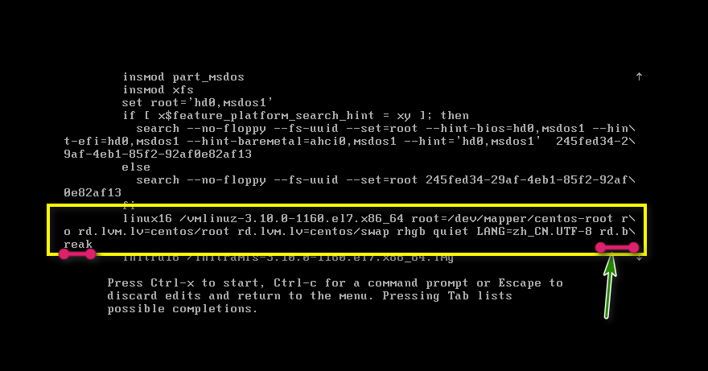
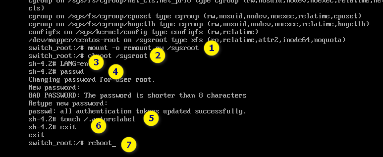

# 忘记root密码的操作

**1.重启系统，进入引导界面按键盘e键：**


**2.光标下拉，找到Linux16这一行，在末尾加上rd.break，然后按Ctrl+X键退出当前编辑进入单用户模式：**



**3.进入单用户模式后依次输入以下命令：**


```shell
mount -o remount,rw /sysroot				# 挂载到sysroot分区
chroot /sysroot								# 切换到/sysroot分区
LANG=en										# 语言环境为en
passwd										# 设置root密码，连续输入两次，密码不会显示
touch /.autorelabel							# 创建配置文件
exit 										# 退出当前状态
reboot										# 重启系统
```



