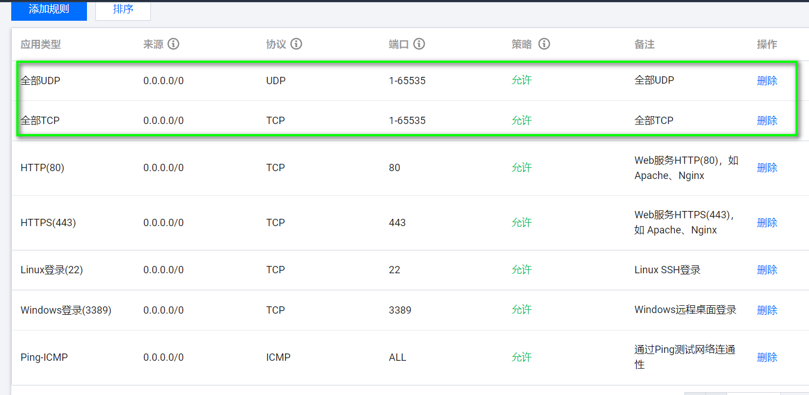
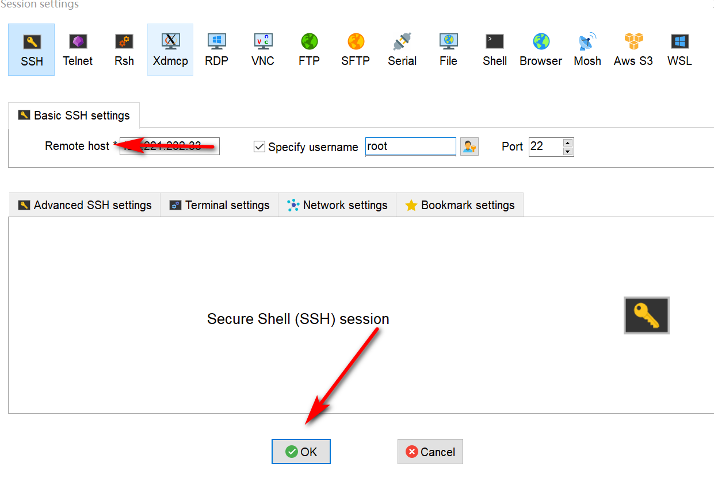

# 服务器注册使用

## 1.购买服务器

​	**1.在腾讯云、阿里云等平台购买服务器，此处以腾讯云为例：**


**2.点击想要购买的服务器，如果是初次购买，需要进行实名制：**


**3.点击购买：**


**4.确认相关信息，进行支付：**


## 2.配置服务器

**1.购买服务器后会进入如下页面：**


**2.点击进入，点击管理进行设置--找到防火墙，在左上角添加规则，添加TCP和UDP协议，添加完成后如下：**



**3.点击菜单栏的概要，点击关机，然后点击重置密码进行密码设置：**


**4.重置密码后点击开机：**


## 3.登录服务器

**1.打开远程连接工具MobaXterm或者Windows的cmd命令中进行连接，如果连接不上就重装以下系统：**




**2.创建test.sh文件，输出Hello World进行测试：**


远程登录后可以输入以下命令安装宝塔面板：

```shell
yum install -y wget && wget -O install.sh http://download.bt.cn/install/install_6.0.sh && sh install.sh ed8484bec
```

安装完成后，复制以下内容，进行登录：


亦可输入命令bt--14查看面板信息：

​	


## 4.安装MySQL

**1.检测系统是否自带mysql:**

```shell
yum list installed | grep mysql
```

**2.如果发现有安装，先删除系统自带的mysql，然后再安装：**

```shell
yum -y remove mysql-libs.x86_64
```

**3.官网下载或直接下载yum repository安装：**

```shell
wget https://dev.mysql.com/get/mysql80-community-release-el7-6.noarch.rpm
```

**4.安装rpm包：**

```shell
rpm -ivh mysql80-community-release-el7-6.noarch.rpm --force --nodeps
# --force --nodeps选项为强制安装，并忽略依赖信息
```

**5.安装mysql:**

```shell
yum install mysql-community-server --nogpgcheck
# --nogpgcheck不检查GPG包的影响
```

**6.设置root用户的密码，这种方式在此处设置会报错，我们可以在第8步检索出密码再修改：**

```shell
mysql_secure_installation
```


**7.启动mysql:**

```shell
systemctl restart mysqld.service
```


**8.查看密码，mysql安装好后会为我们初始化一个密码，这个密码可以通过如下方式获取：**

```shell
grep "password" /var/log/mysqld.log
```


**9.登录mysql:**

```shell
mysql -uroot -p
密码输入上面第8步的密码
```

**如果输入密码报错，可以编辑配置文件:**

```shell
vim /etc/my.cnf
# 在文件中（大概26-7行）添加如下内容，跳过密码检测
skip_grant_tables


# 重启mysql
systemctl restart mysqld.service
# 登录，提示输入密码可以不用输入，直接按回车
mysql -uroot -proot
```


**10.重置密码：**

```shell
use mysql;
# 密码大小写带符号
alter user 'root'@'localhost' identified by '@Ztr940407';
```

再退出注释掉/etc/my.cnf的skip_grant_tables，重启输入密码登录。


**如想要将密码设置简单，可以按如下步骤：**


## 5.安装python

​	因yum源安装的Python3比较旧，所以建议下载后手动编译，并且OpenSSL版本也比较旧，需要重新下载openssl11。

**因官网源下载比较慢，备份阿里云或腾讯云下载：**

```shell
tar -zcvf CentOS-bk.tar.gz /etc/yum.repos.d/CentOS-*
curl -o /etc/yum.repos.d/CentOS-Base.repo http://mirrors.aliyun.com/repo/Centos-7.repo
curl -o /etc/yum.repos.d/epel.repo http://mirrors.aliyun.com/repo/epel-7.repo
```

**下载OpenSSL:**

```shell
yum -y groupinstall "Development tools" 
yum install -y ncurses-devel gdbm-devel xz-devel sqlite-devel tk-devel uuid-devel readline-devel bzip2-devel libffi-devel
yum install -y openssl-devel openssl11 openssl11-devel
```

**到Python官网https://www.python.org/ 下载对应的版本，也可以在CentOS上直接下载：**

```shell
mkdir -p /doc/temp && cd /doc/temp 
wget https://www.python.org/ftp/python/3.10.4/Python-3.10.4.tgz
# 以上过程根据网络，可能优点慢
```

**设置CFLAGS和OpenSSL:**

```shell
export CFLAGS=$(pkg-config --cflags openssl11)
export LDFLAGS=$(pkg-config --libs openssl11)
```

**解压Python文件，并进入源码目录：**

```shell
tar xvzf Python-3.10.4.tgz
cd Python-3.10.4
```

**手动编译，此过程需要耗费2-3分钟：**

```shell
./configure --enable-optimizations && make altinstall
```

**编译完成，验证：**

```shell
/usr/local/bin/python3.10 --version
/usr/local/bin/pip3.10 --version
```


**以上命令较为复杂，我们可以配置软连接，简化命令：**

```shell
ln -sf /usr/local/bin/python3.10 /usr/bin/python3
ln -sf /usr/local/bin/pip3.10  /usr/bin/pip3
```

**验证：**


**由于官方提供的pip包管理工具可能比较慢，我们可以配置一些国内的服务器来进行使用：**

```shell
mkdir -p ~/.pip
touch ~/.pip/pip.conf
vim ~/.pip/pip.conf
```

**配置如下：**

```shell
[global]
index-url=https://pypi.tuna.tsinghua.edu.cn/simple/
extra-index-url=
        http://pypi.douban.com/simple/
        http://mirrors.aliyun.com/pypi/simple/
#proxy = [user:passwd@]proxy.server:port
[install]
trusted-host=
        pypi.tuna.tsinghua.edu.cn
        pypi.douban.com
        mirrors.aliyun.com
```

**验证配置：**

```shell
pip3 install --upgrade pip
```


## 6.安装jdk

```shell
yum search java | grep jdk			# 查询Java版本号
yum install -y java-1.8.0*			# 安装java8
vim /etc/profile					# 修改配置文件
```

在文件最后几行添加如下内容：

```shell
export JAVA_HOME=/usr/lib/jvm/java-1.8.0-openjdk-1.8.0.322.b06-1.el7_9.x86_64
export PATH=$JAVA_HOME$/jre/bin:$PATH
export CLASSPATH=.:$JAVA_HOME/lib/dt.jar:$JAVA_HOME/lib/tools.jar
```

加载配置文件：

```shell
source /etc/profile
```

```shell
java -version						# 验证安装  
```

创建java文件传输到root目录下，通过以下方式进行编译运行：

```shell
javac java文件
java 文件名不带后缀
```


## 7.部署

在云服务器中购买域名并备案，将项目部署到宝塔面板。


点击“未部署”，网站/ssl证书下面的未部署/let’s encrypt/文件验证/勾上域名。